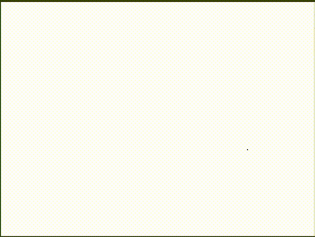

# Paint Draw

A JavaScript paint and draw app that I made when I was bored in class. [Live Version](https://victorribeiro.com/paintDraw/)

I often think about mergin this to my [photoEditor](https://github.com/victorqribeiro/photoEditor)

## How to Use

Keyboard and mouse only (for now).

Press **P** for Pencil

Press **E** for Eraser 

Press **L** for Line

Press **C** for Circle

Press **R** for Rectangle

Right click and Save as when you're done.

## Fun Fact

After I created this simple app, my colegue [Amanda](https://www.instagram.com/amanda_gobus) drew this incredible art from cuphead using it. How cool is that?

